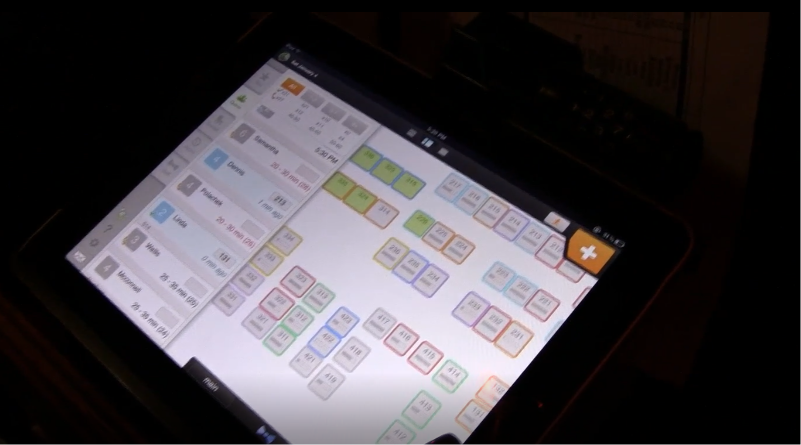

# NoWait Usability Testing and Feature Recommendations

## Project Overview

**Client**: NoWait

**Timeframe**: 4 months

**Role**: UX Researcher

**Platform**: Mobile and Tablet Devices / Apple and Android OS

**Tools & Methods**: Heuristic Analysis & Contextual Inquiry

**Website**: [NoWait](http://www.nowait.com/)

## Project Summary

A Pittsburgh-based startup, NoWait, approached our team to conduct a comprehensive usability testing of their restaurant management application. The goal was to identify the pain points in their current system, understand the needs of their customers, and make informed recommendations for feature enhancements.

## Objectives

The main objective was to ensure that NoWait's application was meeting the demands of their clients effectively. We focused on analyzing the application's usability to discover bugs, gather feedback, and enhance user satisfaction.

## Responsibilities

My responsibilities in this project included:

- **Project & Scope Estimation**: Assessing the scale of the usability study and planning the resources (myself and the client’s customers schedules) accordingly.
- **Heuristic Analysis**: Conducting an expert review of the current application to evaluate its usability against recognized usability principles.
- **Testing**: Planning and executing contextual inquiry user observation with users to collect qualitative and quantitative data.
- **Writing & Report Generation**: Compiling the findings into a comprehensive report, highlighting key issues and recommending actionable improvements.

## Process

### Heuristic Analysis

The process began with a heuristic analysis of the existing application. This involved a thorough review of the application's interface and interactions to identify any usability issues that could be hindering user experience.

### Contextual Inquiry and Testing

Following the heuristic evaluation, a series of usability tests were conducted. These sessions provided valuable insights into how real users interacted with the application and where they faced difficulties.

### Key Insights

1. Communication and clear delegation of duties is critical when multiple staff are using the app simultaneously on different devices. Confusion can happen if it's unclear who is responsible for adding parties, assigning tables, seating guests, clearing tables etc.
2. Accurately estimating wait times is tricky. Basing it purely on the number of parties in the queue doesn't account for table turnover rates. An algorithm that factors in average meal durations could help provide more accurate estimates.
3. Apps need to be intuitive and easy to use, especially for less tech-savvy staff. Issues mentioned include small text size, unintuitive navigation, syncing delays between devices. Ongoing training is important.
4. Keeping the floor map and table statuses up-to-date is important but often neglected when it's busy. Incentivizing clearing tables quickly would improve data accuracy. Integrating with a POS system could help automate some of this.
5. Allowing customers to add themselves to the waitlist via the consumer app is useful, but no-shows are an issue. Having a way to track/discourage serial offenders would help.
6. Customizable tags for marking waitlist entries (booth preference, highchair needed etc.) are useful for planning table assignments.
7. Pending party bugs caused frustrations when assigning tables. Crashes during peak periods also caused problems. Ongoing app improvements to increase reliability would be welcomed.

## Outcomes

The usability testing highlighted several critical areas where the application was not meeting user expectations. Based on these findings, a detailed report was produced, outlining the issues and providing clear recommendations for improving the application's usability.

![image of final report] 

### Final Report Recommendations:

- Synchronization problems between devices - You suggest adding a "pull to refresh" feature.
- Inaccurate wait time estimates - You suggest aggregating average table times to provide more accurate estimates.
- Issues with consumer app no-shows - You suggest automatically removing no-shows after a configurable time window.
- Staff responsibilities and device usage confusion - You suggest specific account types based on user tasks.
- Pending party bugs - I called these out as a source of frustration but did not provide any potential fixes.

## Conclusion

The case study for NoWait's usability testing and feature recommendations demonstrates a successful application of UX methodologies to enhance a product's user experience. It stands as a testament to the importance of understanding user needs and constantly iterating on a product to ensure it serves its users effectively.

## Learn More

For more details on the project and its outcomes, visit [NoWait](http://www.nowait.com/). [NOTE: NoWait was aquired by Yelp]